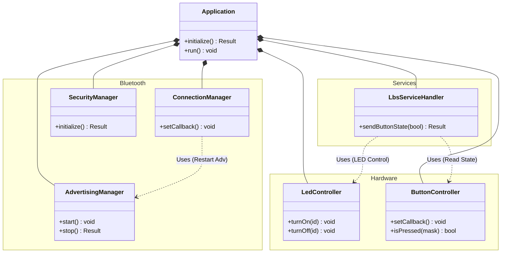

# ソースコード設計ドキュメント

このディレクトリには、C++ によるクラスベースの設計で実装されたソースコードが含まれています。
各モジュールは責務ごとに分割され、疎結合な設計となっています。

## ディレクトリ構成と責務

| ディレクトリ | 責務 |
|---|---|
|Root (`src/`) | アプリケーションのエントリーポイントおよびメインオーケストレーター |
|`bluetooth/` | Bluetooth LE スタックの管理（広告、接続、セキュリティ） |
|`hardware/` | ハードウェア抽象化層（LED、ボタン） |
|`services/` | GATT サービスのハンドリング |
|`common/` | 汎用ユーティリティ（Result型など） |
|`config/` | コンパイル時定数定義 |

## クラスの責務

### Core
*   **`nrf::Application`**: アプリケーションのメインクラス。全コンポーネントの初期化、イベントハンドラのセットアップ、メインループの実行を担当します。
*   **`main.cpp`**: C言語のエントリーポイント。`Application` インスタンスを生成し、Zephyr の `BT_CONN_CB_DEFINE` マクロ用のグローバルコールバックを提供します。

### Bluetooth
*   **`nrf::bluetooth::AdvertisingManager`**: 広告データの設定と、広告の開始・停止を管理します。
*   **`nrf::bluetooth::ConnectionManager`**: 接続・切断イベントをハンドリングし、切断時の広告再開などを制御します。
*   **`nrf::bluetooth::SecurityManager`**: ペアリング、ボンディング処理、およびセキュリティコールバック（パスキー表示など）を管理します。

### Hardware
*   **`nrf::hardware::LedController`**: ボード上の LED 制御（点灯、消灯、状態設定）を抽象化します。
*   **`nrf::hardware::ButtonController`**: ボタンの初期化と状態変化割り込みのハンドリングを行います。

### Services
*   **`nrf::services::LbsServiceHandler`**: Nordic LED Button Service (LBS) のラッパーです。GATT 経由の LED 制御要求を処理し、ボタン状態の変化を通知として送信します。

## クラス依存関係図 (Mermaid)

